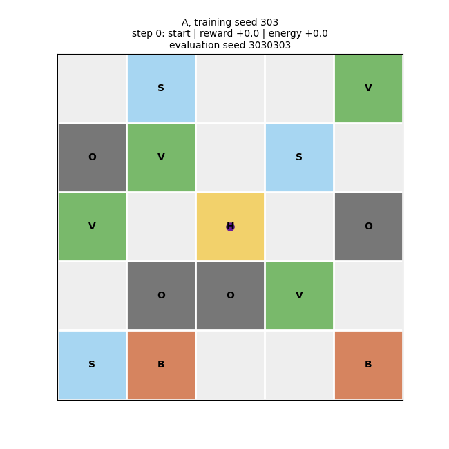

# Primal Hunt

This project models a primitive hunter's daily survival problem as a finite-horizon Markov decision process. The hunter navigates a stochastic grid containing vegetation, animals, and obstacles, choosing risk-reward trade-offs to maximize final energy. A DQN agent learns from position, visited cells, remaining time, and cumulative energy using valid-action masking.

The demonstration first tunes key hyperparameters and then compares full DQN against variants without experience replay, without a target network, and without either mechanism across five seeds. Training curves, greedy policy evaluations, stability metrics, maps, and policy animations illustrate how replay and target networks affect learning stability and final policy quality.




*Full DQN (configuration A) greedy policy trained with seed 303.*


## MDP

Primal Hunt is a finite-horizon Markov decision process:

- **State:** a 25-value position one-hot vector, a 25-value visited-cell mask,
  normalized remaining steps, and scaled cumulative energy (52 values total).
- **Actions:** left, up, right, and down. Moves outside the grid or into an
  already visited cell are invalid.
- **Transition:** movement is deterministic; food, effort, and injury outcomes
  at the destination are stochastic.
- **Energy:** cumulative energy changes by `food - effort - injury` at every
  step and remains part of the state and diagnostics.
- **Reward:** `food - effort - injury` at every step, with no additional
  terminal reward or penalty.
- **Horizon:** six actions.
- **Objective:** maximize expected final cumulative energy. Survival, defined as
  final energy greater than zero, is reported as a secondary metric.

The visited mask is part of the state because it determines which future
actions are valid.

**See `analysis.ipynb` for detailed analysis.**

## Ablation Study

The four configurations are:

| ID  | Experience replay | Target network | Description                   |
| --- | ----------------: | -------------: | ----------------------------- |
| A   |               yes |            yes | Full DQN                      |
| B   |               yes |             no | DQN without target network    |
| C   |                no |            yes | DQN without experience replay |
| D   |                no |             no | Online neural Q-learning      |

Run a multi-seed study and generate its plots with:

```bash
env/bin/python scripts/run_hyperparameter_study.py
env/bin/python scripts/analyze_hyperparameter_study.py
env/bin/python scripts/train.py --run-all --seeds 101 202 303 404 505 \
  --lr 0.001 --batch-size 128 --target-update 50 --warmup-steps 1000 \
  --epsilon-decay 30000 --hidden-dim 64
env/bin/python scripts/analyze_study.py
env/bin/python scripts/animate_policies.py
```

Each trained policy is evaluated greedily on held-out environment seeds.
Training logs are saved per configuration and seed; `ablation_summary.csv`
contains means and between-seed standard deviations.

## Project Layout

Project commands live in `scripts/`. Generated files are organized under
`results/` by category:

```text
results/
├── training/
│   ├── episodes/     # Per-episode training CSVs
│   ├── evaluations/  # Periodic greedy-evaluation CSVs
│   ├── checkpoints/  # Final policy checkpoints
│   └── summaries/    # Training summary JSON files
├── hyperparameter_study/ # Controlled screening and validation
└──  analysis/          # Final analysis tables and optional exported figures
```

```bash
env/bin/python scripts/train.py
env/bin/python scripts/simulate.py
env/bin/python scripts/analyze_study.py
```
